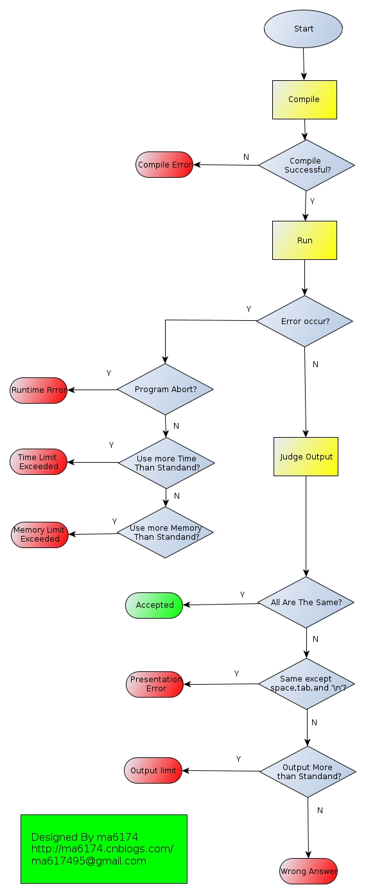
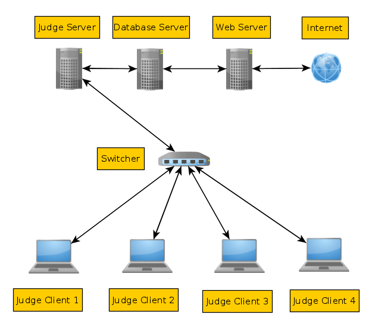

# ACM在线测评系统评测程序设计与实现

### 写此文目的

- 让外行人了解ACM，重视ACM
- 让ACMer了解评测程序评测原理以便更好得做题
- 让pythoner了解如何使用更好的使用python

在讲解之前，先给外行人补充一些关于ACM的知识。

### 什么是ACM？

我们平常指的ACM是`ACM/ICPC`（国际大学生程序设计竞赛），这是由ACM（Association for Computing Machinery，美国计算机协会）组织的年度性竞赛，始于1970年，是全球大学生计算机程序能力竞赛活动中最有影响的一项赛事。被誉为计算机界奥林匹克。

了解更多关于ACM的信息可以参考：

- 百度百科：[http://baike.baidu.com/view/201684.htm](http://baike.baidu.com/view/201684.htm)
- 维基百科：[http://zh.wikipedia.org/wiki/ACM国际大学生程序设计竞赛](http://zh.wikipedia.org/wiki/ACM国际大学生程序设计竞赛)
- ACM国际大学生程序设计竞赛指南:[http://xinxi.100xuexi.com/view/trend/20120328/47133.html](http://xinxi.100xuexi.com/view/trend/20120328/47133.html)

### 什么是ACM测评系统？

为了让同学们拥有一个练习和比赛的环境，需要一套系统来提供服务。

系统要提供如下功能：

- 用户管理
- 题目管理
- 比赛管理
- 评测程序

典型的ACM评测系统有两种

- 一种是C/S模式，典型代表是PC^2。主要用在省赛，区预赛，国际赛等大型比赛中。官网：[http://www.ecs.csus.edu/pc2/](http://www.ecs.csus.edu/pc2/)
- 另一种是B/S模式，国内外有几十个类似网站，主要用于平常练习和教学等。国内比较流行的OJ有：
    - 杭州电子科技大学：[http://acm.hdu.edu.cn/](http://acm.hdu.edu.cn/)
    - 北京大学：[http://poj.org/](http://poj.org/)
    - 浙江大学：[http://acm.zju.edu.cn/onlinejudge/](http://acm.zju.edu.cn/onlinejudge/)
    - 山东理工大学：[http://acm.sdut.edu.cn/sdutoj/index.php](http://acm.sdut.edu.cn/sdutoj/index.php)

### 评测程序是做什么的？

评测程序就是对用户提交的代码进行编译，然后执行，将执行结果和OJ后台正确的测试数据进行比较，如果答案和后台数据完全相同就是AC(Accept)，也就是你的程序是正确的。否则返回错误信息，稍后会详细讲解。

### ACM在线测评系统整体架构

为了做到低耦合，我们以数据库为中心，前台页面从数据库获取题目、比赛列表在浏览器上显示，用户通过浏览器提交的代码直接保存到数据库。

评测程序负责从数据库中取出用户刚刚提交的代码，保存到文件，然后编译，执行，评判，最后将评判结果写回数据库。

### 评测程序架构

评测程序要不断扫描数据库，一旦出现没有评判的题目要立即进行评判。为了减少频繁读写数据库造成的内存和CPU以及硬盘开销，可以每隔0.5秒扫描一次。为了提高评测速度，可以开启几个进程或线程共同评测。由于多线程/进程会竞争资源，对于扫描出来的一个题目，如果多个评测进程同时去评测，可能会造成死锁，为了防止这种现象，可以使用了`生产者-消费者`模式，也就是建立一个待评测题目的任务队列，这个队列的`生产者`作用就是扫描数据库，将数据库中没有评测的题目列表增加到任务队列里面。消费者作用就是从队列中取出要评测的数据进行评测。

### 为什么任务队列能防止出现资源竞争和死锁现象？

python里面有个模块叫`Queue`，我们可以使用这个模块建立三种类型的队列：

- FIFO：先进先出队列
- LIFO：后进先出队列
- 优先队列

这里我们用到的是先进先出队列，也就是先被添加到队列的代码先被评测，保持比赛的公平性。

队列可以设置大小，默认是无限大。

生产者发现数据库中存在没有评测的题目之后，使用put()方法将任务添加到队列中。这时候如果队列设置大小并且已经满了的话，就不能再往里面放了，这时候生产者就进入了等待状态，直到可以继续往里面放任务为止。在等待状态的之后生产者线程已经被阻塞了，也就是说不再去扫描数据库，因此适当设置队列的大小可以减少对数据库的读写次数。

消费者需要从任务队列获取任务，使用`get()`方法，一旦某个线程从队列`get`得到某个任务之后，其他线程就不能再次得到这个任务，这样可以防止多个评测线程同时评测同一个程序而造成死锁。如果任务队列为空的话，get()方法不能获得任务，这时候评线程序就会阻塞，等待任务的到来。在被阻塞的时候评测程序可以被看做停止运行了，可以明显减少系统资源消耗。

队列还有两个方法：

一个是`task_done()`，这个方法是用来标记队列中的某个任务已经处理完毕。

另一个是`join()`方法，join方法会阻塞程序直到所有的项目被删除和处理为止，也就是调用`task_done()`方法。

这两个方法有什么作用呢？因为评测也需要时间，一个任务从队列中取出来了，并不意味着这个任务被处理完了。如果没有处理完，代码的状态还是未评判，那么生产者会再次将这个代码从数据库取出加到任务队列里面，这将造成代码重复评测，浪费系统资源，影响评测速度。这时候我们需要合理用这两个方法，保证每个代码都被评测并且写回数据库之后才开始下一轮的扫描。后面有代码示例。

我们使用如下代码创建一个FIFO队列：

```python
#初始化队列
q = Queue(config.queue_size)
```

### 如何有效得从数据库获取数据？

这里我们以mysql为例进行说明。python有数据库相关的模块，使用起来很方便。这里我们需要考虑异常处理。

有可能出现的问题是数据库重启了或者偶尔断开了不能正常连接，这时候就需要不断尝试重新连接直到连接成功。然后判断参数，如果是字符串就说明是sql语句，直接执行，如果是列表则依次执行所有的语句，如果执行期间出现错误，则关闭连接，返回错误信息。否则返回sql语句执行结果。

下面这个函数专门来处理数据库相关操作

```python
def run_sql(sql):
    '''执行sql语句,并返回结果'''
    con = None
    while True:
        try:
            con = MySQLdb.connect(config.db_host,config.db_user,config.db_password,
                                  config.db_name,charset=config.db_charset)
            break
        except: 
            logging.error('Cannot connect to database,trying again')
            time.sleep(1)
    cur = con.cursor()
    try:
        if type(sql) == types.StringType:
            cur.execute(sql)
        elif type(sql) == types.ListType:
            for i in sql:
                cur.execute(i)
    except MySQLdb.OperationalError,e:
        logging.error(e)
        cur.close()
        con.close()
        return False
    con.commit()
    data = cur.fetchall()
    cur.close()
    con.close()
    return data
```

需要注意的是这里我们每次执行sql语句都要重新连接数据库，能否一次连接，多次操作数据库？答案是肯定的。但是，这里我们需要考虑的问题是如何将数据库的连接共享？可以设置一个全局变量。但是如果数据库的连接突然断开了，在多线程程序里面，问题就比较麻烦了，你需要在每个程序里面去判断是否连接成功，失败的话还要重新连接，多线程情况下如何控制重新连接？这些问题如果在每个sql语句执行的时候都去检查的话太麻烦了。

有一种方法可以实现一次连接，多次操作数据库，还能方便的进行数据库重连，那就是使用yield生成器，连接成功之后，通过yield将sql语句传递进去，执行结果通过yield反馈回来。这样听起来很好，但是有个问题容易被忽略，那就是yield在不支持多线程，多个线程同时向yield发送数据，yield接收谁？yield返回一个数据，谁去接收？这样yield就会报错，然后停止执行。当然可以使用特殊方法对yield进行加锁，保证每次都只有一个线程发送数据。

通过测试发现，使用yield并不能提高评测效率，而每次连接数据库也并不慢，毕竟现在服务器性能都很高。所以使用上面的每次连接数据库的方法还是比较好的。

还有一个问题，当多线程同时对数据库进行操作的时候，也容易出现一些莫名其妙的错误，最好是对数据库操作加锁：

```python
#创建数据库锁，保证一个时间只能一个程序都写数据库
dblock = threading.Lock()
# 读写数据库之前加锁
dblock.acquire()
# 执行数据库操作
runsql()
# 执行完毕解锁
dblock.release()
```

### 生产者如何去实现？

为了隐藏服务器信息，保证服务器安全，所有的SQL语句都用五个#代替。

生产者就是一个while死循环，不断扫描数据库，扫描到之后就向任务队列添加任务。

```python
def put_task_into_queue():
    '''循环扫描数据库,将任务添加到队列'''
    while True:
        q.join() #阻塞安程序,直到队列里面的任务全部完成
        sql = "#####"
        data = run_sql(sql)
        for i in data:
            solution_id,problem_id,user_id,contest_id,pro_lang = i
            task = {
                "solution_id":solution_id,
                "problem_id":problem_id,
                "contest_id":contest_id,
                "user_id":user_id,
                "pro_lang":pro_lang,
            }
            q.put(task)
        time.sleep(0.5) #每次扫面完后等待0.5秒，减少CPU占有率
```

### 消费者如何实现？

基本是按照上面说的来的，先获取任务，然后处理任务，最后标记任务处理完成。

```python
def worker():
    '''工作线程，循环扫描队列，获得评判任务并执行'''
    while True:
        #获取任务，如果队列为空则阻塞
        task = q.get()  
        #获取题目信息
        solution_id = task['solution_id']
        problem_id = task['problem_id']
        language = task['pro_lang']
        user_id = task['user_id']
        # 评测
        result=run(problem_id,solution_id,language,data_count,user_id)
        #将结果写入数据库
        dblock.acquire()
        update_result(result) 
        dblock.release()
        #标记一个任务完成
        q.task_done()   
```

### 如何启动多个评测线程？

```python
def start_work_thread():
    '''开启工作线程'''
    for i in range(config.count_thread):
        t = threading.Thread(target=worker)
        t.deamon = True
        t.start()
```

这里要注意`t.deamon=True`，这句的作用是当主线程退出的时候，评测线程也一块退出，不在后台继续执行。


### 消费者获取任务后需要做什么处理？

因为代码保存在数据库，所以首先要将代码从数据库取出来，按文件类型命名后保存到相应的评判目录下。然后在评判目录下对代码进行编译，如果编译错误则将错误信息保存到数据库，返回编译错误。编译通过则运行程序，检测程序执行时间和内存，评判程序执行结果。

### 如何编译代码？

根据不同的编程语言，选择不同的编译器。我的评测程序支持多种编程语言。编译实际上就是调用外部编译器对代码进行编译，我们需要获取编译信息，如果编译错误，需要将错误信息保存到数据库。

调用外部程序可以使用python的subprocess模块，这个模块非常强大，比os.system()什么的牛逼多了。里面有个Popen方法，执行外部程序。设置`shell=True`我们就能以shell方式去执行命令。可以使用`cwd`指定工作目录，获取程序的外部输出可以使用管道PIPE，调用`communicate()`方法可以可以获取外部程序的输出信息，也就是编译错误信息。

可以根据编译程序的返回值来判断编译是否成功，一般来说，返回值为0表示编译成功。

有些语言，比如`ruby`和`perl`是解释型语言，不提供编译选项，因此在这里仅仅加上`-c`参数做简单的代码检查。

`python`，`lua`，`java`等可以编译成二进制文件然后解释执行。

ACMer们着重看一下`gcc`和`g++`和`pascal`的编译参数，以后写程序可以以这个参数进行编译，只要在本地编译通过一般在服务器上编译就不会出现编译错误问题。

可能有些朋友会有疑问：为什么加这么多语言？正式ACM比赛只让用`C`,`C++`和`JAVA`语言啊！对这个问题，我只想说，做为一个在线测评系统，不能仅仅局限在ACM上。如果能让初学者用这个平台来练习编程语言不是也很好？做ACM是有趣的，用一门新的语言去做ACM题目也是有趣的，快乐的去学习一门语言不是学得很快？我承认，有好多语言不太适合做ACM，因为ACM对时间和内存要求比较严格，好多解释执行的语言可能占内存比较大，运行速度比较慢，只要抱着一种学习编程语言的心态去刷题就好了。此外，对于新兴的`go`语言，我认为是非常适合用来做ACM的。牛逼的`haskell`语言也值得一学，描述高级数据结果也很方便。感兴趣的可以试试。

我的评测程序是可以扩展的，如果想再加其他编程语言，只要知道编译参数，知道如何执行，配置好编译器和运行时环境，在评测程序里面加上就能编译和评测。

```python
def compile(solution_id,language):
    '''将程序编译成可执行文件'''
    build_cmd = {
        "gcc"    : "gcc main.c -o main -Wall -lm -O2 -std=c99 --static -DONLINE_JUDGE",
        "g++"    : "g++ main.cpp -O2 -Wall -lm --static -DONLINE_JUDGE -o main",
        "java"   : "javac Main.java",
        "ruby"   : "ruby -c main.rb",
        "perl"   : "perl -c main.pl",
        "pascal" : 'fpc main.pas -O2 -Co -Ct -Ci',
        "go"     : '/opt/golang/bin/go build -ldflags "-s -w"  main.go',
        "lua"    : 'luac -o main main.lua',
        "python2": 'python2 -m py_compile main.py',
        "python3": 'python3 -m py_compile main.py',
        "haskell": "ghc -o main main.hs",
    }
    p = subprocess.Popen(build_cmd[language],shell=True,cwd=dir_work,stdout=subprocess.PIPE,stderr=subprocess.PIPE)
    out,err =  p.communicate()#获取编译错误信息
    if p.returncode == 0: #返回值为0,编译成功
        return True
    dblock.acquire()
    update_compile_info(solution_id,err+out) #编译失败,更新题目的编译错误信息
    dblock.release()
    return False
```

### 用户代码在执行过程中是如何进行评判的（ACMer必看）？

前面说了，如果出现编译错误(Compile Error)，是不会执行的。每个题目都有一个标准的时间和内存限制，例如时间`1000ms`，内存`65536K`，程序在执行的时候会实时检查其花费时间和使用内存信息，如果出现超时和超内存将会分别返回`Time Limit Exceeded`和`Memory Limit Exceeded`错误信息，如果程序执行时出现错误，比如非法指针，数组越界等，将会返回`Runtime Error`信息。如果你的程序没有出现上面的信息，说明程序顺利执行结束了。接下来，就是对你的程序的输出也就是运行结果进行检查，如果你的执行结果和我们的标准答案完全一样，则返回`Accepted`，也就说明你这个题目做对了。如果除去空格，换行，tab外完全相同，则说明你的代码格式错误，将返回`Presentation Error`，如果你输出的内容有一部分和标准答案完全一样，但是还输出了一些其他内容，则说明你多输出了，这时候将返回`Output Limit Exceeded`错误信息，出现其他情况，就说明你的输出结果和标准答案不一样，就是`Wrong Answer`了。

总结一下错误的出现顺序：

`Compile Error` -> `Memory Limit Exceeded` = `Time Limit Exceeded` = `Runtime Error` -> `Wrong Answer` -> `Output Limit Exceeded` -> `Presentation Error` -> `Accepted`

直接说难免有些空洞，做了张流程图：



如果你得到了其他信息，比如`System error`，则说明服务器端可能出问题了，我们技术人员会想法解决。如果看到`waiting`，说明等待评测的代码比较多，你需要稍作等待，直到代码被评测。如果你得到了`Judging`结果，说明你的代码正在评测，如果长时间一直是`Judging`，则说明评测程序在评测过程中可能出问题了，没有评判出结果就停止了。技术人员会为你重判的。

希望ACMer们能根据上面的评测流程，在看到自己的评判结果的时候，能够分析出你离AC还有多远，以及如何改进你的代码才能AC。

评判答案的那部分源码：

```
def judge_result(problem_id,solution_id,data_num):
    '''对输出数据进行评测'''
    currect_result = os.path.join(config.data_dir,str(problem_id),'data%s.out'%data_num)
    user_result = os.path.join(config.work_dir,str(solution_id),'out%s.txt'%data_num)
    try:
        curr = file(currect_result).read().replace('\r','').rstrip()#删除\r,删除行末的空格和换行
        user = file(user_result).read().replace('\r','').rstrip()
    except:
        return False
    if curr == user:       #完全相同:AC
        return "Accepted"
    if curr.split() == user.split(): #除去空格,tab,换行相同:PE
        return "Presentation Error"
    if curr in user:  #输出多了
        return "Output limit"
    return "Wrong Answer"  #其他WA
```

注意一下，代码中有个`replace('\r','')`方法，它的作用就是将`\r`替换成空字符串。为什么要做这个替换呢？因为在windows下，文本的换行是`"\r\n"`,而在Linux下是`"\n"`。因为不能确定测试数据来源与windows还是Linux，增加一个`\r`，就是增加一个字符，如果不删除的话，两个文本就是不一样的，就会造成`wrong answer`结果。或许你曾经遇到过在windows下用记事本打开一个纯文本文件，格式全乱了，所有文本都在一行内，非常影响阅读。你可以通过用写字板打开来解决这个问题。据说`"\r\n"`来源于比较古老的打印机，每打印完一行，都要先`“回车(\r)”`，再`“换行”(\n)`。同样一个C语言的`printf("\n")`函数，在windows下将生成`"\r\n"`，而在Linux下生成`"\n"`，因为评测程序为你自动处理了，因此你就不必关注这些细节的东西了。

### 评测程序是如何检测你的程序的执行时间和内存的？

这个问题困扰了我好久，也查了好多资料。

用户的程序要在服务器上执行，首先不能让用户的程序无限申请内存，否则容易造成死机现象，需要将程序的内存限制在题目规定的最大内存内。其次要限制用户程序的执行时间，不能让用户的程序无限制运行。

一般解决方案是：在用户的程序执行前，先做好资源限制，限制程序能使用的最大内存和CPU占用，当用户的程序一旦超出限制就自动终止了。还有个比较重要的问题是如何获取程序执行期间的最大内存占用率。用户的代码在执行前需要申请内存，执行期间还能动态申请和释放内存，执行完毕释放内存。程序执行时还有可能使用指针等底层操作，这无疑给检测内存造成更大的困难。在windows下，程序执行结束后，可以调用系统函数获取程序执行期间的最大内存，貌似在Linux下没用现成的函数可以调用。

在Linux下，我们可以使用`ps`或`top`命令来获取或监视在某个时刻应用程序的内存占用率，要获取程序的最大执行内存，就要不断去检测，不断去比较，直到程序结束，获取最大值就是用户程序执行期间的最大内存。根据这个设想，我写了一个程序来实现这个想法：

```python
def get_max_mem(pid):
    '''获取进程号为pid的程序的最大内存'''
	glan = psutil.Process(pid)
	max = 0
	while True:
		try:
			rss,vms = glan.get_memory_info()
			if rss > max:
				max = rss
		except:
			print "max rss = %s"%max
			return max

def run(problem_id,solution_id,language,data_count,user_id):
    '''获取程序执行时间和内存'''
    time_limit = (time_limit+10)/1000.0
    mem_limit = mem_limit * 1024
    max_rss = 0
    max_vms = 0
    total_time = 0
    for i in range(data_count):
        '''依次测试各组测试数据'''
        args = shlex.split(cmd)
        p = subprocess.Popen(args,env={"PATH":"/nonexistent"},cwd=work_dir,stdout=output_data,stdin=input_data,stderr=run_err_data)
        start = time.time()
        pid = p.pid
        glan = psutil.Process(pid)
        while True:
            time_to_now = time.time()-start + total_time
            if psutil.pid_exists(pid) is False:
                program_info['take_time'] = time_to_now*1000
                program_info['take_memory'] = max_rss/1024.0
                program_info['result'] = result_code["Runtime Error"]
                return program_info
            rss,vms = glan.get_memory_info()
            if p.poll() == 0:
                end = time.time()
                break
            if max_rss < rss:
                max_rss = rss
                print 'max_rss=%s'%max_rss
            if max_vms < vms:
                max_vms = vms
            if time_to_now > time_limit:
                program_info['take_time'] = time_to_now*1000
                program_info['take_memory'] = max_rss/1024.0
                program_info['result'] = result_code["Time Limit Exceeded"]
                glan.terminate()
                return program_info
            if max_rss > mem_limit:
                program_info['take_time'] = time_to_now*1000
                program_info['take_memory'] = max_rss/1024.0
                program_info['result'] =result_code["Memory Limit Exceeded"]
                glan.terminate()
                return program_info

        logging.debug("max_rss = %s"%max_rss)
#        print "max_rss=",max_rss
        logging.debug("max_vms = %s"%max_vms)
#        logging.debug("take time = %s"%(end - start))
    program_info['take_time'] = total_time*1000
    program_info['take_memory'] = max_rss/1024.0
    program_info['result'] = result_code[program_info['result']]
    return program_info
```

上面的程序用到了一些进程控制的一些知识，简单说明一下。

程序的基本原理是：先用多进程库subprocess的Popen函数去创建一个新的进程，获取其进程号(pid)，然后用主线程去监测这个进程，主要是监测实时的内存信息。通过比较函数，获得程序的执行期间的最大内存。什么时候停止呢？有四种情况：

1. 程序运行完正常结束。这个我们可以通过 subprocess.Popen里面的poll方法来检测，如果为0,则代表程序正常结束。
2. 程序执行时间超过了规定的最大执行时间，用terminate方法强制程序终止
3. 程序执行内存超过了规定的最大内存，terminate强制终止。
4. 程序执行期间出现错误，异常退出了，这时候我们通过检查这个pid的时候就会发现不存在。

还有一点是值得注意的：上文提到在编译程序的时候，调用`subprocess.Popen`，是通过shell方式调用的，但是这里没有使用这种方式，为什么呢？这两种方式有什么区别？最大的区别就是返回的进程的pid，以shell方式执行，返回的pid并不是子进程的真正pid，而是shell的pid，当我们去检查这个pid的内存使用率的时候得到的并不是用户进程的pid！不通过shell方式去调用外部程序则是直接返回真正程序的pid，而不用去调用shell。官方文档是这么说的：`if shell is true, the specified command will be executed through the shell.`

如果不用shell方式去执行命令的话，传递参数的时候就不能直接将字符串传递过去，例如`ls -l`这个命令`ls`和参数`-l`，当`shell=False`时，需要将命令和参数变成一个列表`['ls','-l']`传递过去。当参数比较复杂的时候，将命令分隔成列表就比较麻烦，幸好python为我们提供了`shlex`模块，里面的split方法就是专门用来做这个的，官方文档是这么说的：`Split the string s using shell-like syntax.`，最好不要自己去转换，有可能会导致错误而不能执行。

### 上面的检测内存和时间的方法靠谱吗？

不靠谱，相当不靠谱！（当然学学python如何对进程控制也没坏处哈！）为什么呢？有点经验的都知道，C语言的运行效率比python高啊！执行速度比python快！这会造成什么后果？一个简单的`hello world`小程序，C语言“瞬间”就执行完了，还没等我的python程序开始检测就执行完了，我的评测程序什么都没检测到，然后返回0，再小的程序内存也不可能是0啊！在OJ上显示内存为0相当不科学！

那怎么办？能不能让C语言的程序执行速度慢下来？CPU的频率是固定的，我们没法专门是一个程序的占用的CPU频率降低，在windows下倒是有`变速齿轮`这款软件可以让软件执行速度`变慢`，不知道在`Linux`下有没有。还有没有其他办法？聪明的你也许会想到`gdb`调试，我也曾经想用这种方法，用gdb调试可以使程序单步执行，然后程序执行一步，我检测一次，多好，多完美！研究了好一阵子gdb，发现并不是那么简单。首先，我们以前用gdb调试C/C++的时候，在编译的时候要加上一个`-g`参数，然后执行的时候可以单步执行，此外，还有设置断点什么的。有几个问题：

1. 其他语言如何调试？比如java，解释执行的，直接调试java虚拟机吗？
2. 如何通过python对gdb进行控制？还有获取执行状态等信息。

这些问题都不是很好解决。

那上面的方法测量的时间准吗？不准！为什么？我们说的程序的执行时间，严格来说是占用CPU的时间。因为CPU采用的是轮转时间片机制，在某个时刻，CPU在忙别的程序。上面的方法用程序执行的结束时间减去开始时间，得到的时间一定比它实际执行的时间要大。如果程序执行速度过快，不到1毫秒，评测程序也不能检测出来，直接返回0了。

### 如何解决时间和内存的测量问题？

后来在`v2ex`上发了一个帖子提问，得到高人指点，使用`lorun`。`lorun`是github上的一个开源项目，项目地址：[https://github.com/lodevil/Lo-runner](https://github.com/lodevil/Lo-runner)，这是用C语言写的一个python扩展模块，让程序在一个类似沙盒的环境下执行，然后精准的获取程序的执行时间和内存，还能对程序进行限制，限制程序的系统调用。原文是这么说的：`We use this python-c library to run program in a sandbox-like environment. With it, we can accurately known the resource using of the program and limit its resource using including system-call interrupt.`。安装使用都非常方便。我主要用它来测量执行时间和内存，后期代码检查还是用我的程序。

感兴趣的同学可以将这个模块下载下来，作为本地测试使用，可以预先生成一些测试数据，然后测量你的代码的执行时间和内存，比对你的答案是否正确。

### 不同编程语言时间内存如何限定？

一般来说，假设C/C++语言的标程是时间限制：1000ms,内存限制32768K，那么java的时间和内存限制都是标准限制的2倍，即2000ms，65536K。

由于后来我再OJ增加了好多其他语言，我是这样规定的：编译型的语言和速度较快的解释型语言的时间和内存限制和C/C++是一样的，这样的语言包括：`C、C++、go、haskell、lua、pascal`，其他速度稍慢的解释执行的语言和JAVA是一样的，包括：`java、python2、python3、ruby、perl`。毕竟使用除C，C++，JAVA外的语言的朋友毕竟是少数，如果限制太严格的话可以根据实际情况对其他编程语言放宽限制。

### 多组测试数据的题目时间和内存如何测算？

多组测试数据是一组一组依次执行，时间和内存取各组的最大值，一旦某组测试数据时间和内存超出限制，则终止代码执行，返回超时或超内存错误信息。

### 如何防止恶意代码破坏系统？

我们可以使用以下技术来对用户程序进行限制：

1. `lorun`模块本身就有限制，防止外部调用
2. 降低程序的执行权限。在Linux下，目录权限一般为`755`，也就是说，如果换成一个别的用户，只要不是所有者，就没有修改和删除的权限。python里面可以使用`os.setuid(int(os.popen("id -u %s"%"nobody").read()))`来将程序以`nobody`用户的身份执行
3. 设置沙盒环境，将用户执行环境和外部隔离。Linux下的chroot命令可以实现，python也有相关方法，但是需要提前搭建沙盒环境。用`jailkit`可以快速构建沙盒环境，感兴趣的朋友可以看看
4. 使用`ACL访问控制列表`进行详细控制，让`nobody`用户只有对某个文件夹的读写权限，其他文件夹禁止访问
5. 评判机和服务器分离，找单独的机器，只负责评判
6. 对用户提交的代码预先检查，发现恶意代码直接返回`Runtime Error`
7. 禁止评测服务器连接外网，或者通过防火墙限制网络访问

### 如何启动和停止评测程序以及如何记录错误日志？

启动很简单，只要用python执行`protect.py`就行了。

如果需要后台执行的话可以使用Linux下的`nohup`命令。

为了防止同时开启多个评测程序，需要将以前开启的评测程序关闭。

为了方便启动，我写了这样一个启动脚本：

```bash
#!/bin/bash
sudo kill `ps aux | egrep "^nobody .*? protect.py" | cut -d " "  -f4`
sudo nohup python protect.py &
```

第一条命令就是杀死多余的评测进程，第二条是启动评测程序。

在程序里面使用了logging模块，是专门用来记录日志的，这么模块很好用，也很强大，可定制性很强，对我们分析程序执行状态有很大帮助。下面是一些示例：

```
2013-03-07 18:19:04,855 --- 321880 result 1
2013-03-07 18:19:04,857 --- judging 321882
2013-03-07 18:19:04,881 --- judging 321883
2013-03-07 18:19:04,899 --- judging 321884
2013-03-07 18:19:04,924 --- 321867 result 1
2013-03-07 18:19:04,950 --- 321883 result 7
2013-03-07 18:19:04,973 --- 321881 result 1
2013-03-07 18:19:05,007 --- 321884 result 1
2013-03-07 18:19:05,012 --- 321882 result 4
2013-03-07 18:19:05,148 --- judging 321885
2013-03-07 18:19:05,267 --- judging 321886
2013-03-07 18:19:05,297 --- judging 321887
2013-03-07 18:19:05,356 --- judging 321888
2013-03-07 18:19:05,386 --- judging 321889
2013-03-07 18:19:05,485 --- 321885 result 1
```

### python的配置文件如何编写？

最简单有效的方式就是建立一个`config.py`文件，里面写上配置的内容，就像下面一样：

```python
#!/usr/bin/env python
#coding=utf-8
#开启评测线程数目
count_thread = 4
#评测程序队列容量
queue_size = 4
#数据库地址
db_host = "localhost"
#数据库用户名
db_user = "user"
#数据库密码
db_password = "password"
#数据库名字
db_name = "db_name"
```

使用的时候只需要将这个文件导入，然后直接`config.queue_size`就可以访问配置文件里面的内容，很方便的。


### 评测程序的评测效率如何？

自从服务器启用新的评测程序之后，已经经历了两次大的比赛和几次大型考试，在几百个人的比赛和考试中，评测基本没用等待现象，用户提交的代码基本都能立即评测出来。大体测了一下，单服务器平均每秒能判6个题目左右（包括获取代码，编译，运行，检测，数据库写入结果等流程）。评测程序目前已经稳定运行了几个月，没有出现大的问题，应该说技术比较成熟了。

### 评测程序还能继续改进吗？

当时脑子估计是被驴踢了，居然使用多线程来评测！有经验的python程序猿都知道，python有个全局`GIL`锁，这个锁会将python的多个线程序列化，在一个时刻只允许一个线程执行，无论你的机器有多少个CPU，只能使用一个！这就明显影响评测速度！如果换成多进程方式，一个评测进程占用一个CPU核心，评测速度将会是几倍几十倍的性能提升！到时候弄个上千人的比赛估计问题也不大，最起码评测速度能保证。

此外，还可以构建一个分布式的评测服务器集群，大体设想了一下可以这样实现：

首先，可以选一台服务器A专门和数据库交互，包括从数据库中获取评测任务以及评测结束将结果写回数据库。然后选择N台普通计算机作为评测机，评测机只和数据库A打交道，也就是从服务器A获取任务，在普通机器上评测，评测完后将结果反馈到服务器A，再由A将结果写入到数据库。服务器A在这里就充当一个任务管理和分配的角色，协调各个评测机去评测。这样可以减少对数据库的操作，评测机就不用去一遍一遍扫数据库了。评测的速度和安全性可以得到进一步提升。




### 其他

- 上面的程序和方法仅供学习和研究用，严禁任何非法用途
- 本人学识有限，如有错误欢迎批评指正

